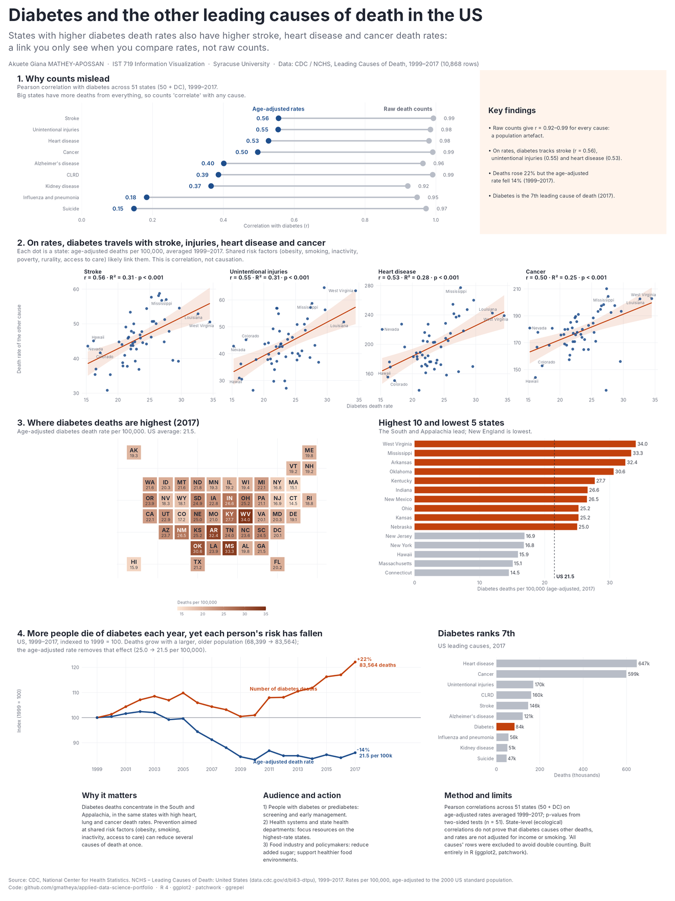
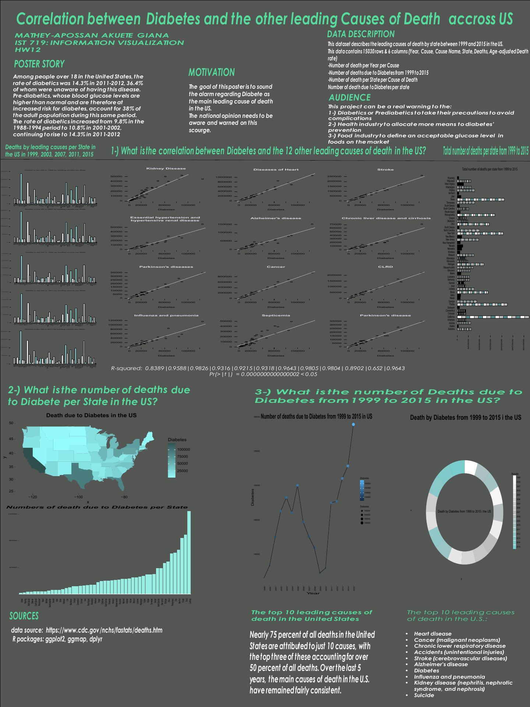
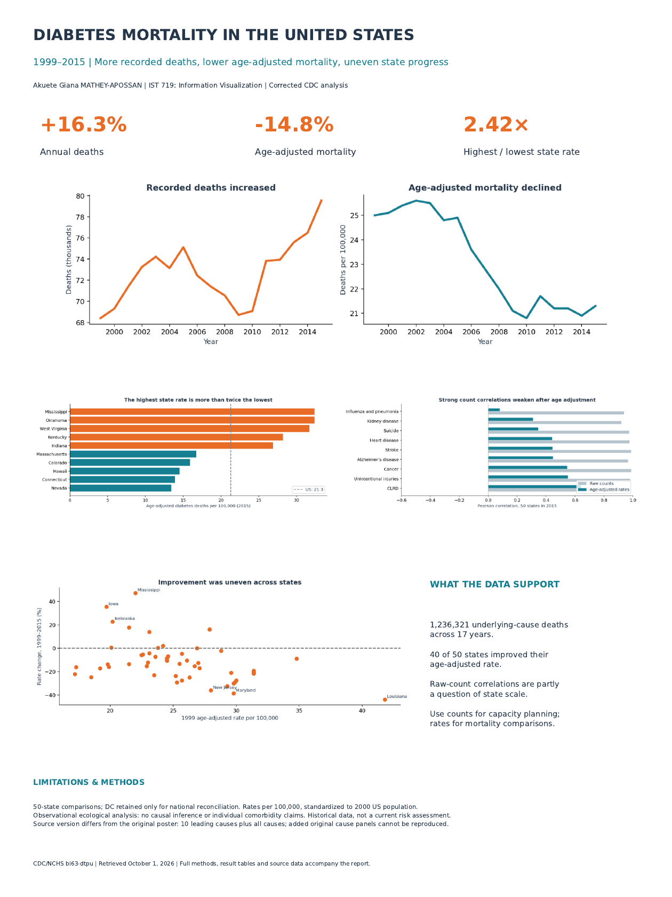

# Diabetes and the other leading causes of death in the US

**IST 719 Information Visualization · Syracuse University · Akuete Giana Mathey-Apossan**

**One-line result:** across US states, diabetes death rates move with stroke (r = 0.56), heart disease (r = 0.53) and cancer (r = 0.50) once you compare **age-adjusted rates**. Raw counts make every cause look linked (r = 0.92–0.99).



[Full poster (PDF, 24 × 32 in)](output/diabetes_poster.pdf) · [R code](diabetes_poster.R) · [Correlation table](output/correlations.csv)

---

## 1. Problem
Is diabetes linked to the other leading causes of death in the United States, and where is the burden highest? The audience is people living with diabetes or prediabetes, state health departments, and policymakers who decide where prevention money goes.

## 2. Data
- **Source:** CDC / National Center for Health Statistics, *Leading Causes of Death: United States*, 1999–2017 ([data.cdc.gov/d/bi63-dtpu](https://data.cdc.gov/d/bi63-dtpu)). Public data.
- **Size:** 10,868 rows × 6 columns (year, cause, state, deaths, age-adjusted death rate per 100,000).
- **Cleaning:** removed the "All causes" rows (they double-count) and kept the national rows only for the US trend. 51 units of analysis: the 50 states plus DC.

## 3. Method
- Averaged each state's age-adjusted rate over 1999–2017, then computed the Pearson correlation between diabetes and every other cause (two-sided tests, n = 51).
- Repeated the same correlations on raw death counts to show why counts mislead.
- Indexed the national trend to 1999 = 100, so deaths and rates share **one axis** (no dual-axis chart).
- Built the whole poster in R: `ggplot2`, `patchwork`, `ggrepel`.

## 4. Result
| Finding | Number |
|---|---|
| Correlation of counts with diabetes, any cause | r = 0.92 to 0.99 (a population artefact) |
| Strongest rate correlations | stroke 0.56 · unintentional injuries 0.55 · heart disease 0.53 · cancer 0.50 |
| Highest state, 2017 | West Virginia, 34.0 per 100,000 (US 21.5) |
| National trend, 1999 → 2017 | deaths +22% (68,399 → 83,564); age-adjusted rate −14% (25.0 → 21.5) |
| Rank among leading causes, 2017 | 7th |

**Limits:** these are state-level (ecological) correlations. They do not show that diabetes causes other deaths, and rates are not adjusted for income or smoking.

## 5. Decision it supports
Prevention aimed at shared risk factors (obesity, smoking, inactivity, access to care) in the South and Appalachia can reduce several causes of death at once. State health departments can use the map and the top-10 list to target resources.

---

## How the poster evolved

| Version 1: course poster | Version 2: Python revision | Version 3: this R version |
|---|---|---|
|  |  |  |

**What changed and why**

1. **Counts became rates.** Version 1 compared raw death counts, so California and Texas dominated every chart. Age-adjusted rates remove the population and age effect, and the dumbbell chart (panel 1) shows the difference directly.
2. **The claim was corrected by the data.** Version 1 framed diabetes as "the main leading cause of death". The data shows it ranks 7th. The story is now the *link* between diabetes and other causes, which the data supports.
3. **One question per panel.** Twelve similar scatter plots became four small multiples with r, R² and p-values in the titles.
4. **Colour has one job.** Orange marks diabetes and the story, blue marks the comparison, grey is context. The map uses a single-hue sequential scale.
5. **No dual axis.** Deaths and rates are indexed to 1999 = 100 on one axis.
6. **Reproducible.** One R script rebuilds every number and chart from the CDC file.

## Reproduce
```r
# 1. Download the CSV from https://data.cdc.gov/d/bi63-dtpu into data/
# 2. install.packages(c("readr","dplyr","tidyr","ggplot2","forcats","stringr",
#                       "patchwork","scales","ggrepel","ragg","systemfonts"))
# 3. Run (save the script as UTF-8):
source("diabetes_poster.R")   # writes output/diabetes_poster.pdf and .png
```

## Skills shown
Data cleaning and aggregation (dplyr, tidyr) · correlation and hypothesis testing · visual encoding choices (dumbbell, small multiples, tile map, indexed lines) · colour and accessibility · poster layout (patchwork) · data storytelling for a policy audience.
